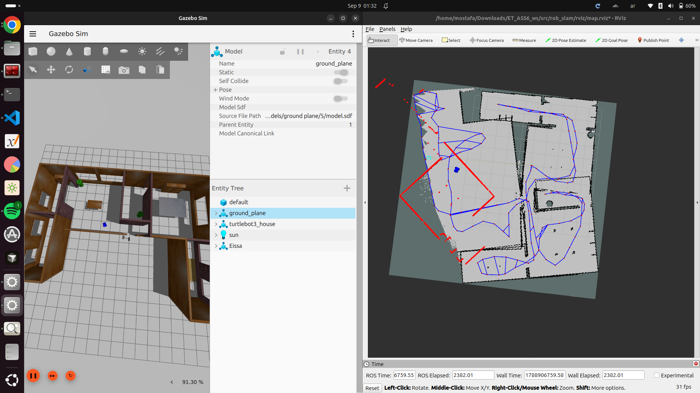
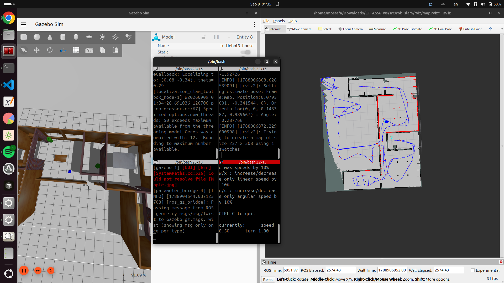
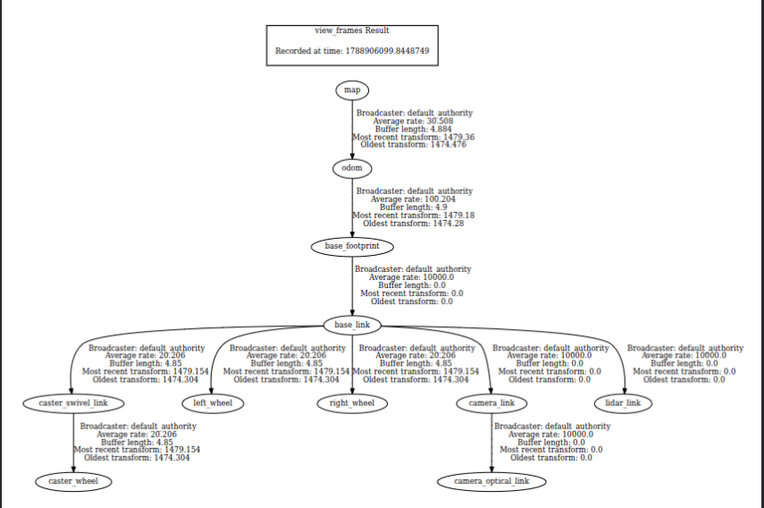

# rob_slam — SLAM Mapping & Localization (ROS 2 + slam_toolbox)

A ROS 2 (Jazzy) package demonstrating full SLAM mapping and
map-based localization using **slam_toolbox**, tested in Gazebo
simulation with RViz2 visualization.

---

## 1. Project Overview

This package contains two complete workflows for the same robot:

- **Mapping** — build an occupancy grid map of the environment from
  scratch using `slam_toolbox`'s online asynchronous mapping mode.
- **Localization** — load a previously built map (deserialized from
  a saved pose graph) and localize the robot within it using laser
  scan matching, seeded by a manual `2D Pose Estimate` in RViz2.

---

## 2. Package Structure

```
ET_ASS6_ws/
├── README.md
└── src/
    └── rob_slam/
        ├── config/
        │   ├── mapper_params_online_async.yaml
        │   └── slam_localization.yaml
        ├── launch/
        │   ├── online_async_launch.py
        │   └── slam_localization.launch.py
        ├── map/
        │   ├── .yaml
        │   ├── .pgm
        │   └── map.png
        ├── posegraph/
        │   ├── my_posegraph.data
        │   └── my_posegraph.posegraph
        ├── rviz/
        │   └── map.rviz
        ├── screenshots_and_DemoVid/
        │   ├── wrong_2D-estimate_pose.png
        │   ├── Right_2D-estimate_pose.png
        │   ├── Tf_tree.png
        │   └── Localization_demo.mp4
        ├── include/
        ├── src/
        ├── CMakeLists.txt
        └── package.xml
```

**Note on `map/`:** the saved map's `.yaml` and `.pgm` files have no
base filename (just the extension), which makes them dot-files ---
`ls` alone will not show them. Use `ls -la` to list the folder, or
open it in VS Code's file explorer, which shows dot-files by default.

---

## 3. Prerequisites

```bash
sudo apt install ros-jazzy-slam-toolbox \
                  ros-jazzy-nav2-map-server \
                  ros-jazzy-rviz2 \
                  ros-jazzy-ros-gz-sim \
                  ros-jazzy-ros-gz-bridge
```

---

## 4. Step-by-Step Setup & Usage

### 4.1 Build the workspace

```bash
cd ~/Downloads/ET_ASS6_ws
rm -rf build/ install/ log/
colcon build --symlink-install --packages-select rob_slam
source install/setup.bash
```

### 4.2 Run mapping (build a new map from scratch)

```bash
ros2 launch rob_slam online_async_launch.py
```

Drive the robot around the environment (e.g.\ with
`teleop_twist_keyboard`) until the map is fully explored.

### 4.3 Save the finished map

```bash
cd src/rob_slam
ros2 run nav2_map_server map_saver_cli -f map/turtlebot3_world_map
```

This is intended to produce `turtlebot3_world_map.yaml` and
`turtlebot3_world_map.pgm`. In this repository it instead produced
`.yaml` and `.pgm` (no base filename) --- see the note under
Section 2 for how to view them.

### 4.4 Save the pose graph

```bash
ros2 service call /slam_toolbox/serialize_map slam_toolbox/srv/SerializePoseGraph "{filename: 'posegraph/my_posegraph'}"
```

Produces `my_posegraph.data` and `my_posegraph.posegraph`.

### 4.5 Run localization (using the saved map)

```bash
ros2 launch rob_slam slam_localization.launch.py
```

In RViz2, use the **2D Pose Estimate** tool to give the robot's
approximate starting position and orientation on the map, matching
what the live laser scan shows relative to the map's walls.

---

## 5. How to Test the Nodes

```bash
ros2 node list          # confirm slam_toolbox, robot_state_publisher, etc. are running
ros2 topic list         # confirm /map, /odom, /scan, /tf, /tf_static are publishing
ros2 topic echo /odom   # confirm live odometry values are updating
ros2 run tf2_tools view_frames   # confirm the full TF tree is connected
```

---

## 6. Expected Output

- **Mapping mode:** an occupancy grid growing on `/map` as the robot
  explores, visible in RViz2.
- **Localization mode:** the robot's laser scan aligning with the
  walls of the previously saved map, once given a correct initial
  pose estimate.
- **TF tree:** a single connected chain,
  `map → odom → base_footprint → base_link → ...`.

---

## 7. Initial Pose Estimate: Wrong vs.\ Correct

Giving `slam_toolbox` (in localization mode) a wrong initial pose
estimate does **not** self-correct on its own — unlike AMCL's global
particle filter, this localization mode performs local scan matching
around the seeded pose only. A pose estimate that is significantly
off causes the live laser scan to visibly disagree with the map's
walls, and the live (in-memory) map can visibly degrade as
mismatched scan data gets inserted into it.

### Wrong Initial Pose



**Observation:** the laser scan did not align with the map's walls;
the live map began to distort as incorrect scan data was matched
against the wrong location.

### Correct Initial Pose



**Observation:** after re-issuing an accurate `2D Pose Estimate`
(visually matched against the map before confirming), the laser scan
aligned correctly with the map's walls and localization stabilized.

**Note:** the wrong pose above was corrected with another `2D Pose
Estimate` before the demo video (Section 10) recording began. The
video itself starts from that corrected state, and shows a further
moment of the estimate self-adjusting slightly — see Section 10 for
why that is expected and different from the wrong-pose failure shown
here.

---

## 8. TF Tree



The tree is rooted at `map`, published by `slam_toolbox` in
localization mode, down through `odom` (continuous odometry) and
`base_footprint`/`base_link` (the robot's own kinematic chain).

---

## 9. `/odom` Topic Output

Sample output of `ros2 topic echo /odom` during localization:

```yaml
header:
  stamp:
    sec: 2548
    nanosec: 360000000
  frame_id: odom
child_frame_id: base_footprint
pose:
  pose:
    position:
      x: -0.15889103758363365
      y: -2.4164165663678188
      z: 0.0
    orientation:
      x: 0.0
      y: 0.0
      z: -0.2687924075224633
      w: 0.9631981320882418
  covariance: [0.0, 0.0, 0.0, 0.0, 0.0, 0.0,
               0.0, 0.0, 0.0, 0.0, 0.0, 0.0,
               0.0, 0.0, 0.0, 0.0, 0.0, 0.0,
               0.0, 0.0, 0.0, 0.0, 0.0, 0.0,
               0.0, 0.0, 0.0, 0.0, 0.0, 0.0,
               0.0, 0.0, 0.0, 0.0, 0.0, 0.0]
twist:
  twist:
    linear: {x: 0.0, y: 0.0, z: 0.0}
    angular: {x: 0.0, y: 0.0, z: 0.0}
  covariance: [0.0, 0.0, 0.0, 0.0, 0.0, 0.0,
               0.0, 0.0, 0.0, 0.0, 0.0, 0.0,
               0.0, 0.0, 0.0, 0.0, 0.0, 0.0,
               0.0, 0.0, 0.0, 0.0, 0.0, 0.0,
               0.0, 0.0, 0.0, 0.0, 0.0, 0.0,
               0.0, 0.0, 0.0, 0.0, 0.0, 0.0]
---
header:
  stamp:
    sec: 2548
    nanosec: 370000000
  frame_id: odom
child_frame_id: base_footprint
pose:
  pose:
    position:
      x: -0.15889103758363365
      y: -2.4164165663678188
      z: 0.0
    orientation:
      x: 0.0
      y: 0.0
      z: -0.2687924075224633
      w: 0.9631981320882418
```

---

## 10. Demo Video

[Demo Video](src/rob_slam/screenshots_and_DemoVid/Localization_demo.mp4)

The wrong initial pose (Section 7) was captured as a screenshot only,
before screen recording started. After correcting it with another
`2D Pose Estimate` in RViz2 (the robot's estimated position snapping
back into place), screen recording was started for this video, which
shows the full localization workflow in Gazebo + RViz2 from that
point on: the robot moving while localized against the saved map.

Partway through the recording, the estimated pose can be seen
adjusting itself slightly. This is because the corrected pose given
beforehand, while close, was not perfectly exact — it was still
within the scan matcher's local correction range, so it refined
itself into full alignment during the recording. This is distinct
from the wrong-pose case in Section 7, where the error was large
enough that no self-correction occurred at all.

---

## 11. Notes

- The pose graph files in `posegraph/` were serialized once, right
  after mapping was completed, and were not overwritten during any
  later localization session — they remain the clean, original map
  data.
- If localization ever needs to be reset to this clean state,
  restart `slam_localization.launch.py`: it re-deserializes the map
  from `posegraph/` on every launch, discarding any corrupted
  in-memory state from a previous bad pose estimate.