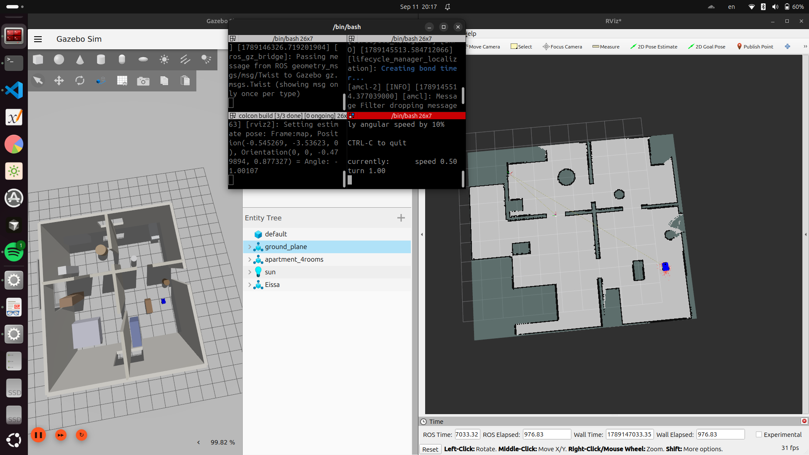
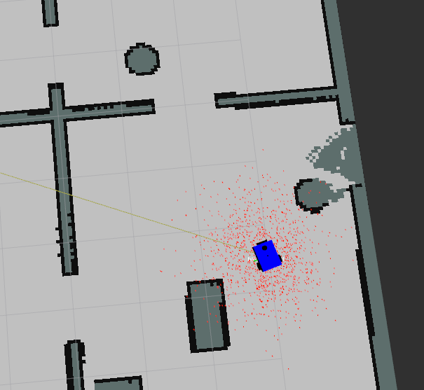
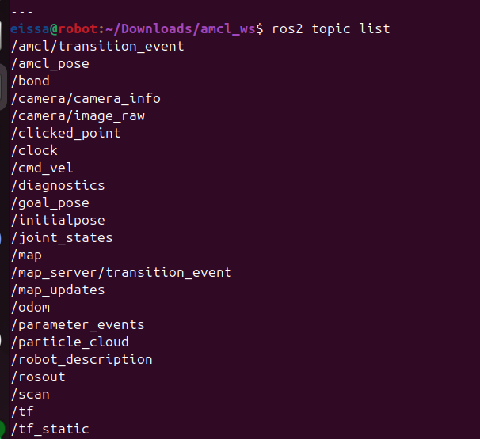

# AMCL Localization & SLAM Project

**Repository:** `amcl-localization-[Mostafa-Eissa]`
**ROS 2 Distribution:** Jazzy
**Simulation:** Gazebo
**Robot:** Mobile differential-drive robot
**Environment:** Custom 4-room apartment with balcony

---

## Project Overview

This project implements a complete **mapping and localization workflow for a mobile robot in ROS 2**, using a simulated four-room apartment environment with an attached balcony in Gazebo.

The project is organized into three ROS 2 packages:

| Package        | Purpose                                                                          |
| -------------- | -------------------------------------------------------------------------------- |
| `robot_gazebo` | Gazebo simulation, apartment world, robot model, sensors, and ROS–Gazebo bridges |
| `robot_slam`   | Mapping the environment using **SLAM Toolbox**                                   |
| `amcl_loc`     | Localizing the robot on the previously generated map using **AMCL**              |

### Workflow

```text
                    ┌─────────────────────┐
                    │   robot_gazebo      │
                    │ Gazebo + Robot +    │
                    │ Sensors + TF + Odom │
                    └──────────┬──────────┘
                               │
                 ┌─────────────┴─────────────┐
                 │                           │
                 ▼                           ▼
        ┌─────────────────┐        ┌─────────────────┐
        │   robot_slam    │        │    amcl_loc     │
        │                 │        │                 │
        │  SLAM Toolbox   │        │ Map Server      │
        │  Mapping Mode   │        │ + AMCL          │
        └────────┬────────┘        └────────┬────────┘
                 │                          │
                 ▼                          ▼
          my_map.pgm                 Robot Localization
          my_map.yaml                on Existing Map
```

The robot is first driven through the simulated apartment while **SLAM Toolbox** builds an occupancy-grid map.

Once the map is complete, it is saved as:

```text
my_map.pgm
my_map.yaml
```

The generated map is then reused by the `amcl_loc` package. AMCL does **not** create a new map; instead, it estimates the robot's position within the existing map using lidar measurements and odometry.

---

# Workspace Setup

The project is located in:

```bash
~/Downloads/amcl_ws
```

Before running ROS 2 commands in a new terminal:

```bash
cd ~/Downloads/amcl_ws
colcon build
source install/setup.bash
```

> **Tip:** Every new terminal requires sourcing the workspace again.

---

# 1. Gazebo Simulation — `robot_gazebo`

## 1.1 Description

The `robot_gazebo` package provides the simulation environment used by both the SLAM and AMCL stages.

It contains:

* Custom four-room apartment with balcony environment
* Mobile robot model
* Robot URDF/Xacro description
* Lidar sensor
* ZED camera
* Odometry
* TF
* ROS 2 ↔ Gazebo topic bridges

The apartment environment is represented by the custom Gazebo model:

```text
four_room_apartment
```

---

## 1.2 Package Structure

```text
robot_gazebo/
├── CMakeLists.txt
├── package.xml
│
├── config/
│   └── gz_bridge.yaml
│
├── launch/
│   └── gazebo.launch.py
│
├── meshes/
│   ├── Caster_Wheel.stl
│   ├── lidar.STL
│   └── zed.stl
│
├── models/
│   └── four_room_apartment/
│       ├── model.config
│       └── model.sdf
│
├── urdf/
│   ├── robot.gazebo.xacro
│   ├── robot.urdf
│   └── robot.urdf.xacro
│
└── worlds/
    └── my_world.sdf
```

Verified package contents:

```bash
cd ~/Downloads/amcl_ws
ls src/robot_gazebo/
```

Expected:

```text
CMakeLists.txt
config
launch
meshes
models
package.xml
urdf
worlds
```

---

## 1.3 Build

```bash
cd ~/Downloads/amcl_ws

colcon build --packages-select robot_gazebo

source install/setup.bash
```

---

## 1.4 Launch Gazebo

```bash
ros2 launch robot_gazebo gazebo.launch.py
```

This launches:

* Gazebo
* The four-room apartment
* The mobile robot
* Robot sensors
* ROS 2 ↔ Gazebo bridges

### Verify ROS 2 topics

In another terminal:

```bash
source ~/Downloads/amcl_ws/install/setup.bash

ros2 topic list
```

Important topics should include the relevant sensor, odometry, and TF topics such as:

```text
/scan
/odom
/tf
/tf_static
```

The exact topic list may vary depending on the bridge and robot configuration.

---

# 2. SLAM Mapping — `robot_slam`

## 2.1 Description

The `robot_slam` package performs **simultaneous localization and mapping (SLAM)** using **SLAM Toolbox**.

The project uses the `online_async` SLAM mode.

During mapping:

```text
Lidar + Odometry
       │
       ▼
  SLAM Toolbox
       │
       ▼
Occupancy Grid Map
       │
       ▼
my_map.pgm + my_map.yaml
```

The robot must be driven throughout the entire apartment so that all four rooms and the balcony are observed.

The resulting map is later used by AMCL for localization.

---

## 2.2 Package Structure

```text
robot_slam/
├── CMakeLists.txt
├── package.xml
│
├── config/
│   ├── mapper_params_online_async.yaml
│   └── slam_localization.yaml
│
├── demo_vid/
│   └── Mapping_Slam.mp4
│
├── launch/
│   ├── online_async_launch.py
│   └── slam_localization.launch.py
│
├── map/
│   ├── my_map.pgm
│   ├── my_map.png
│   └── my_map.yaml
│
├── posegraph/
│   ├── my_posegraph.data
│   └── my_posegraph.posegraph
│
└── rviz/
    └── my_rviz.rviz
```

---

## 2.3 Build

```bash
cd ~/Downloads/amcl_ws

colcon build --packages-select robot_slam

source install/setup.bash
```

---

# 2.4 Running SLAM

### Step 1 — Launch Gazebo

Terminal 1:

```bash
cd ~/Downloads/amcl_ws
source install/setup.bash

ros2 launch robot_gazebo gazebo.launch.py
```

---

### Step 2 — Launch SLAM Toolbox

Terminal 2:

```bash
cd ~/Downloads/amcl_ws
source install/setup.bash

ros2 launch robot_slam online_async_launch.py
```

---

### Step 3 — Launch RViz2

Terminal 3:

```bash
rviz2
```

---

### Step 4 — Configure RViz2

Set:

```text
Fixed Frame: map
```

Add the following displays:

* **Map**
* **MarkerArray**
* **TF**
* **RobotModel**
* **LaserScan**

The most important display during mapping is:

```text
Map
```

which shows the occupancy grid as SLAM Toolbox builds it.

---

### Step 5 — Drive the Robot

Try to completely cover the environment.

### Mapping best practices

* Drive slowly near walls and corners.
* Avoid sudden rotations.
* Pass through doorways carefully.
* Avoid leaving large unexplored regions.
* Return to previously visited areas to help SLAM perform loop closure.
* Make at least one complete loop through the environment before saving.

---

# 2.5 Save the Map

When the map is complete:

```bash
ros2 run nav2_map_server map_saver_cli \
-f ~/Downloads/amcl_ws/src/robot_slam/map/my_map
```

This generates:

```text
my_map.pgm
my_map.yaml
```

The map should then be copied to:

```text
src/amcl_loc/map/
```

For example:

```bash
cp ~/Downloads/amcl_ws/src/robot_slam/map/my_map.pgm \
   ~/Downloads/amcl_ws/src/amcl_loc/map/

cp ~/Downloads/amcl_ws/src/robot_slam/map/my_map.yaml \
   ~/Downloads/amcl_ws/src/amcl_loc/map/
```

> **Important:** Always use the latest map generated from the SLAM run when testing AMCL.

---

# 3. AMCL Localization — `amcl_loc`

## 3.1 Description

The `amcl_loc` package performs robot localization using **Adaptive Monte Carlo Localization (AMCL)**.

Unlike SLAM, AMCL does not create or modify the environment map.

Instead:

```text
Existing Map
     +
Lidar
     +
Odometry
     +
Initial Pose
     │
     ▼
    AMCL
     │
     ▼
Estimated Robot Pose
```

AMCL uses a particle filter to estimate the robot's pose:

```text
x, y, yaw
```

within the known map.

---

## 3.2 Package Structure

```text
amcl_loc/
├── CMakeLists.txt
├── package.xml
│
├── config/
│   └── amcl.yaml
│
├── images_demo/
│   ├── localization.mp4
│   ├── localization.png
│   ├── particels.png
│   └── topic_list.png
│
├── launch/
│   └── amcl.launch.py
│
├── map/
│   ├── my_map.pgm
│   └── my_map.yaml
│
├── tf_tree/
│   ├── frames_2026-09-11_19.55.41.gv
│   └── frames_2026-09-11_19.55.41.pdf
│
├── include/
│   └── # Reserved for C++ headers
│
└── src/
    └── # Reserved for C++ source files
```

---

# 3.3 Build

```bash
cd ~/Downloads/amcl_ws

colcon build --packages-select amcl_loc

source install/setup.bash
```

---

# 3.4 Running AMCL

## Step 1 — Launch Gazebo

Terminal 1:

```bash
cd ~/Downloads/amcl_ws
source install/setup.bash

ros2 launch robot_gazebo gazebo.launch.py
```

---

## Step 2 — Launch AMCL

Terminal 2:

```bash
cd ~/Downloads/amcl_ws
source install/setup.bash

ros2 launch amcl_loc amcl.launch.py
```

The AMCL launch file starts the static map server and AMCL localization node according to the package configuration.

---

## Step 3 — Launch RViz2

Terminal 3:

```bash
rviz2
```

---

## Step 4 — Configure RViz2

Set:

```text
Fixed Frame: map
```

Add:

* **Map**
* **RobotModel**
* **TF**
* **ParticleCloud**
* **LaserScan**

The important relationship is:

```text
map
 │
 ▼
odom
 │
 ▼
base_link
 │
 ├── lidar
 └── camera
```

The exact sensor-frame names depend on the robot URDF.

---

# 3.5 Set the Initial Pose

AMCL needs an initial estimate of the robot's position.

In RViz2:

1. Select **2D Pose Estimate**.
2. Click approximately where the robot is located on the map.
3. Drag the arrow to match the robot's approximate orientation.
4. Observe the particle cloud.
5. Drive the robot slowly.

After receiving lidar observations and odometry, AMCL should converge toward the robot's actual pose.

### Expected behavior

Initially:

```text
Many particles
       ↓
Large uncertainty
```

After localization:

```text
Particles converge
       ↓
Small uncertainty
       ↓
Stable robot pose
```

---

# 3.6 Output Verification

## Localization Result

Screenshot:



### Observation

After providing an initial pose close to the robot's actual position and driving the robot, the AMCL particle distribution converges around the robot's true location.

---

## Particle Cloud

Screenshot:



### Observation

The particle cloud initially represents uncertainty around the estimated pose. As AMCL receives additional laser and odometry information, the particles converge toward the most probable robot pose.

---

## ROS 2 Topic Verification

Screenshot:



The topic list should contain the relevant topics required by the localization system, including:

/scan
/odom
/tf
/tf_static
/map
/amcl_pose
/particlecloud

> Topic names can vary slightly depending on the AMCL and robot configuration.

---

# 3.7 TF Tree Verification

The generated TF tree is stored in:

[TF Tree](src/amcl_loc/images_demo/Tf_tree.png)

Graphviz source:

src/amcl_loc/tf_tree/frames_2026-09-11_19.55.41.gv

The TF tree should provide a valid transform chain connecting the global map frame to the robot and its sensors:

map
 │
 ▼
odom
 │
 ▼
base_link
 │
 ├── lidar frame
 └── camera frame

This transform structure is essential for:

* AMCL
* RViz2
* LaserScan visualization
* RobotModel visualization
* Correct map-to-robot localization

A missing transform can cause RViz displays to disappear or produce errors such as:

Could not find a connection between frames

---

# 3.8 Demo Videos

### SLAM Mapping

<video src="../robot_slam/demo_vid/Mapping_Slam.mp4" width="100%" controls>
  Your browser does not support the video tag. [Watch SLAM Mapping Video](../robot_slam/demo_vid/Mapping_Slam.mp4)
</video>

### AMCL Localization

<video src="images_demo/localization.mp4" width="100%" controls>
  Your browser does not support the video tag. [Watch AMCL Localization Video](images_demo/localization.mp4)
</video>

These videos demonstrate the mapping and localization stages of the project.

# 4. Common Problems & Solutions

## 4.1 Empty or Black Map in RViz2

### Problem

The map appears empty, black, or does not display correctly.

### Common cause

RViz2 is using the wrong Fixed Frame.

### Solution

Set:

```text
Fixed Frame → map
```

The Map display must have a valid transform to the selected Fixed Frame.

---

## 4.2 AMCL Particle Cloud Does Not Converge

### Possible causes

* Incorrect initial pose
* Poor odometry
* Incorrect map
* Map/robot scale mismatch
* Incorrect lidar configuration
* Incorrect TF
* Robot is not moving enough to provide useful observations

### Solution

First reset the initial pose using:

```text
2D Pose Estimate
```

Then drive the robot slowly.

If the problem persists, verify:

```text
map.yaml
TF tree
/scan
/odom
```

and confirm that the map corresponds to the same simulated environment and robot configuration.

---

# 4.3 TF Errors

### Error example

```text
Could not find a connection between frames
```

### Possible causes

* Gazebo bridge not publishing required TF
* Robot State Publisher not running
* Incorrect frame names
* AMCL launched before the robot system is ready

### Solution

Start Gazebo first:

```bash
ros2 launch robot_gazebo gazebo.launch.py
```

Then verify TF:

```bash
ros2 run tf2_tools view_frames
```

Also inspect the generated TF tree.

The expected structure should contain:

```text
map → odom → base_link → sensor frames
```

---

# 4.4 `/amcl_pose` Is Not Publishing

### Possible causes

* Map server failed to load the map
* Incorrect map path
* `my_map.yaml` missing
* `my_map.pgm` missing
* Incorrect image path inside `my_map.yaml`
* AMCL is not receiving the required sensor/TF data

### Check the map

```bash
ls ~/Downloads/amcl_ws/src/amcl_loc/map/
```

Expected:

```text
my_map.pgm
my_map.yaml
```

Check the YAML file:

```bash
cat ~/Downloads/amcl_ws/src/amcl_loc/map/my_map.yaml
```

The image entry should correctly reference the PGM file, for example:

```yaml
image: my_map.pgm
```

Using a relative path is preferable when both files are stored together.

---

# 4.5 SLAM Map Contains Gaps or Misaligned Walls

### Possible causes

* Robot driven too quickly
* Poor scan matching
* Insufficient environment coverage
* Failure to revisit previously mapped areas
* Incorrect lidar configuration
* Poor odometry

### Solution

Repeat the SLAM run and:

1. Drive more slowly.
2. Move carefully through doorways.
3. Follow walls and corners smoothly.
4. Fully explore every room.
5. Map the balcony.
6. Return to previously visited areas.
7. Perform a complete loop-closure pass.
8. Save the map only after the environment is consistently aligned.

---

# 5. Complete Run Sequence

For a clean reproduction of the project, use the following order.

## Stage A — Build

```bash
cd ~/Downloads/amcl_ws

colcon build

source install/setup.bash
```

---

## Stage B — Mapping

### Terminal 1

```bash
ros2 launch robot_gazebo gazebo.launch.py
```

### Terminal 2

```bash
ros2 launch robot_slam online_async_launch.py
```

### Terminal 3

```bash
rviz2
```

Drive the robot through the entire apartment.

Then save:

```bash
ros2 run nav2_map_server map_saver_cli \
-f ~/Downloads/amcl_ws/src/robot_slam/map/my_map
```

Copy the generated map to:

```text
src/amcl_loc/map/
```

---

## Stage C — Localization

Restart the simulation if necessary.

### Terminal 1

```bash
ros2 launch robot_gazebo gazebo.launch.py
```

### Terminal 2

```bash
ros2 launch amcl_loc amcl.launch.py
```

### Terminal 3

```bash
rviz2
```

Set:

```text
Fixed Frame: map
```

Add:

```text
Map
RobotModel
TF
ParticleCloud
LaserScan
```

Use:

```text
2D Pose Estimate
```

to provide the robot's initial pose.

Then drive the robot and verify AMCL convergence.

---

# 6. Key ROS 2 Concepts Demonstrated

This project demonstrates practical understanding of several important robotics concepts:

### Gazebo Simulation

* SDF worlds
* URDF/Xacro robot descriptions
* Gazebo sensors
* Robot simulation
* ROS 2 ↔ Gazebo communication

### SLAM

* SLAM Toolbox
* Laser scan matching
* Odometry integration
* Occupancy-grid mapping
* Loop closure
* Map serialization

### Localization

* AMCL
* Particle-filter localization
* Initial pose estimation
* Laser-based pose correction
* Odometry-based motion prediction

### TF

* `map`
* `odom`
* `base_link`
* Sensor frames
* Coordinate-frame transformations

### RViz2

* Map visualization
* LaserScan visualization
* RobotModel visualization
* TF visualization
* AMCL particle cloud
* Initial pose estimation

---

# 7. Project Results

The completed project demonstrates the following pipeline:

```text
             Gazebo Simulation
                    │
                    ▼
          Robot + Lidar + Odometry
                    │
                    ▼
             SLAM Toolbox
                    │
                    ▼
          Occupancy Grid Map
             ┌──────┴──────┐
             ▼             ▼
         my_map.pgm    my_map.yaml
             │             │
             └──────┬──────┘
                    ▼
                Map Server
                    │
                    ▼
                  AMCL
                    │
             ┌──────┴──────┐
             ▼             ▼
          /amcl_pose   /particlecloud
                    │
                    ▼
          Robot Localization
```

The final system successfully demonstrates how a mobile robot can:

1. Explore an unknown simulated environment.
2. Build an occupancy-grid map using SLAM Toolbox.
3. Save and reuse the generated map.
4. Initialize its pose on the known map.
5. Localize itself using AMCL.
6. Maintain a stable pose estimate using lidar and odometry.
7. Visualize the complete localization system in RViz2.

---

# Repository Summary

```text
amcl_ws/
└── src/
    ├── robot_gazebo/
    │   ├── Gazebo world
    │   ├── Robot model
    │   ├── Sensors
    │   └── ROS-Gazebo bridge
    │
    ├── robot_slam/
    │   ├── SLAM Toolbox configuration
    │   ├── Generated map
    │   ├── Pose graph
    │   └── Mapping demo
    │
    └── amcl_loc/
        ├── AMCL configuration
        ├── Static map
        ├── Localization demo
        └── TF tree
```

---

## Final Outcome

This project provides an end-to-end ROS 2 implementation of:

**Simulation → SLAM Mapping → Map Saving → AMCL Localization → Pose Estimation**

using a custom apartment environment in Gazebo.
