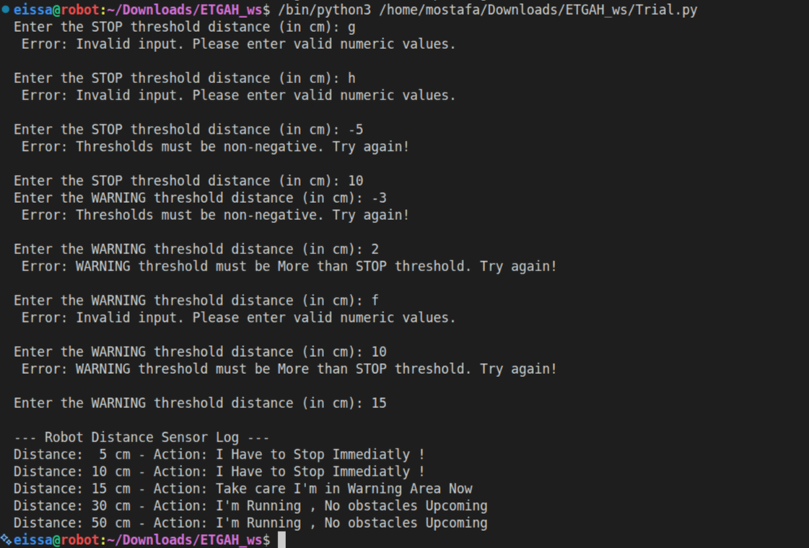

# robot-distance-sensor-Mostafa-Eissa

This project implements an Object-Oriented Python solution to process ultrasonic distance sensor measurements for a mobile robot. It evaluates incoming distance readings against customizable safety thresholds and determines the appropriate action to take.

## Features

* **Class-Based Design:** Encapsulates sensor logic inside a `Robot` class.
* **Robust Input Validation:**
  * Ensures thresholds are non-negative numeric values (`ValueError` handling).
  * Enforces logical constraint: `WARNING_THRESHOLD` must be strictly greater than `STOP_THRESHOLD`.
  * Separated input loops allow users to fix an invalid entry without re-entering valid previous inputs.
* **Action Classification:** Categorizes distance readings into three zones:
  * **STOP:** Distance ≤ Stop Threshold (`"I Have to Stop Immediatly !"`)
  * **WARNING:** Stop Threshold < Distance ≤ Warning Threshold (`"Take care I'm in Warning Area Now"`)
  * **SAFE:** Distance > Warning Threshold (`"I'm Running , No obstacles Upcoming"`)

---

##  Code Structure

* `robot.py` — Main script containing `Robot` class and test logic.
* `README.md` — Project documentation.
* `Sample_Result.png` — Screenshot of test execution and output.

---

## Sample Result

Here is a screenshot of the script running with test cases:

---