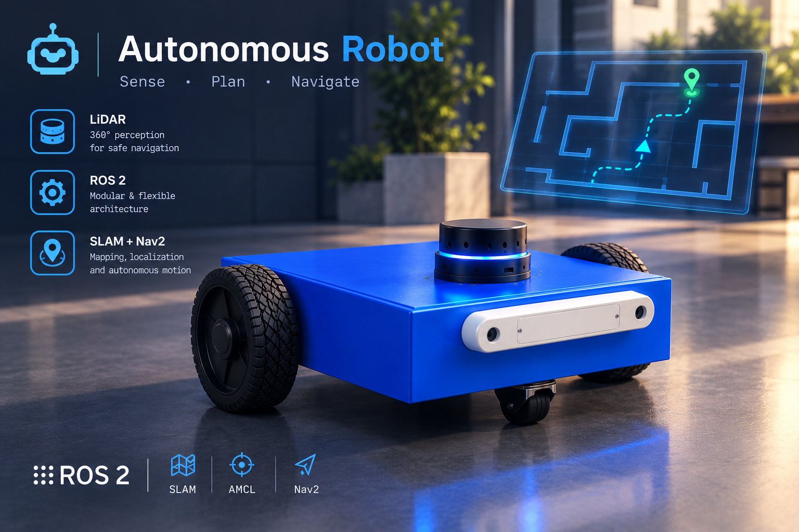
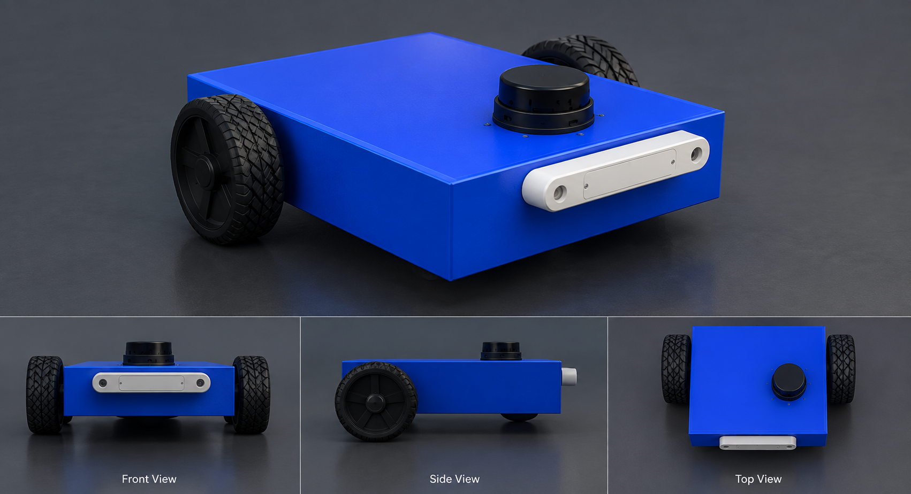
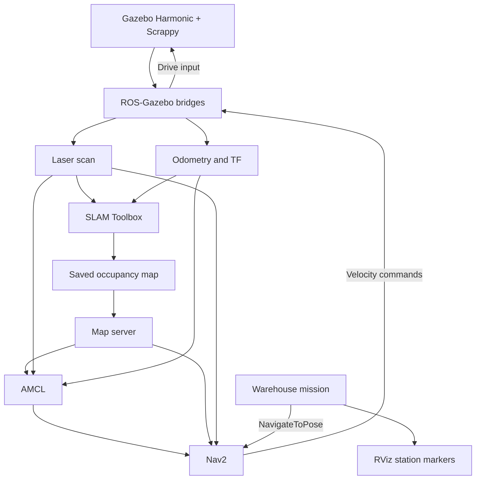

<p align="center">
  
</p>

<h1 align="center">Full Etgah ROS2 Masterclass</h1>
<h2 align="center">Scrappy — From Open-Source Parts to Autonomous Warehouse Navigation</h2>

<p align="center">
  A custom differential-drive robot ("Scrappy"), nine ROS 2 assignments, and a complete autonomous warehouse delivery mission.<br>
  Built and integrated by <strong>Mostafa Eissa</strong>.
</p>

<p align="center">
  
  
  
  
  
  
</p>

<p align="center">
  <a href="#project-overview">Overview</a> ·
  <a href="#the-nine-stage-journey">The 9 stages</a> ·
  <a href="#package-guide">Final project packages</a> ·
  <a href="#system-architecture">Architecture</a> ·
  <a href="#build-and-environment">Build</a> ·
  <a href="#run-the-warehouse-mission">Run the mission</a> ·
  <a href="#rviz-operator-guide">RViz guide</a> ·
  <a href="#updated-wheel-mesh--xacro-file">Updated wheel mesh</a> ·
  <a href="#problems-encountered">Troubleshooting log</a>
</p>


<p align="center">
  


> *Nine repositories. One robot. Zero CAD files.*

## 🎬 Demo

A full narrated recording of SLAM mapping, AMCL localization, Nav2 goal testing, the autonomous mission, and the RViz markers updating live is available here:

**[Watch the demonstration video](https://drive.google.com/drive/folders/1Qra18BZYhyeVpj-MjPMVwO96DapfvSLD?usp=drive_link)**

---

## Project overview

This repository collects my work through the **ETGAH ROS 2 Robotics Masterclass** — nine assignments, each one its own repository, kept with full commit history and merged here with `git subtree`. It starts with plain Python and a distance sensor, and ends with **Scrappy**: a fully autonomous differential-drive robot completing a real warehouse delivery mission.

**Final mission summary:**
- Start at the **Charging Station (Home)**.
- Navigate to the **Loading Station** and wait **30 seconds**.
- Navigate to the **Storage Area**.
- Navigate to the **Shipping Station**.
- Return to the **Charging Station (Home)**.
- Wait for each Nav2 navigation result before sending the next goal.
- If any goal fails, stop the mission and report the failed location.

> **Note on the robot platform:** this project uses a custom-built differential-drive robot ("Scrappy"), assembled from open-source LiDAR, camera, and caster-wheel meshes, in place of the TurtleBot3 Burger specified in the base assignment. No CAD software was used — everything was tuned directly in Xacro. This substitution was reviewed and approved by the team leader prior to submission.

> **Note on the drive wheels:** after finishing the rest of the project, I replaced the plain xacro-drawn cylinder wheels with a real wheel STL mesh for a more realistic look and collision shape. See [Updated wheel mesh & Xacro file](#updated-wheel-mesh--xacro-file) below for the exact file, where to get it, and how to drop it into any package you want to run.

| Platform | Perception | Mission |
| :--- | :--- | :--- |
| Custom differential-drive robot, open-source STL meshes | Simulated LiDAR and ZED RGB-D camera | Four named stations, sequential Nav2 goals |
| URDF/Xacro, TF2, Gazebo Harmonic | Laser scans, RGB images, depth | Home check, Loading wait, failure reporting |

### Explore the project

- [The nine-stage journey](#the-nine-stage-journey): every assignment, what I actually built, and what it taught me.
- [Package guide](#package-guide): the four packages behind the final warehouse mission.
- [System architecture](#system-architecture): how sensing, localization, Nav2, and mission control connect.
- [Build and environment](#build-and-environment): the two workspaces this project needs.
- [Run the warehouse mission](#run-the-warehouse-mission): start simulation, localize, navigate, run the mission.
- [RViz operator guide](#rviz-operator-guide): displays, tools, and marker colors.
- [Updated wheel mesh & Xacro file](#updated-wheel-mesh--xacro-file): the real wheel STL and how to install the new Xacro file.
- [Problems encountered](#problems-encountered): five real bugs and how each was fixed.

## The nine-stage journey

| # | Task | Focus | Repo |
| ---: | :--- | :--- | :--- |
| 1 | Programming for Robotics | Python, OOP, distance-sensor mini project | [`robot-distance-sensor`](https://github.com/mustafakhaleed/robot-distance-sensor-Mostafa-Eissa) |
| 2 | Linux Essentials & ROS 2 Fundamentals | Nodes, topics, TurtleBot keyboard control | [`turtlebot-controller`](https://github.com/mustafakhaleed/turtlebot-controller-mostafa-eissa) |
| 3 | ROS 2 Services | Custom `.srv`, obstacle avoidance with manual override | [`turtlebot_operation`](https://github.com/mustafakhaleed/turtlebot_operation_mostafa-eissa) |
| 4 | ROS 2 Actions | Custom `.action`, TurtleBot delivery mission | [`turtlebot_delivery`](https://github.com/mustafakhaleed/turtlebot_delivery_mostafa-eissa) |
| 5 | Robot Modeling, TF2 & Gazebo | Scrappy is born — URDF/Xacro, no CAD | [`task5-robot_description`](https://github.com/mustafakhaleed/task5-robot_description) |
| 6 | SLAM Toolbox | Occupancy-grid mapping, pose-graph localization | [`slam-mapping-localization`](https://github.com/mustafakhaleed/slam-mapping-localization-mostafa-eissa) |
| 7 | AMCL Localization | Full apartment world: map, save, localize | [`amcl-localization`](https://github.com/mustafakhaleed/amcl-localization-mostafa-eissa) |
| 8–9 | Nav2 + Warehouse Waypoint Delivery | The final autonomous mission | [`warehouse-waypoint-nav`](https://github.com/mustafakhaleed/warehouse-waypoint-nav-mostafa-eissa) |

Each stage below is a real snapshot of what that assignment actually contained — not a summary of the course syllabus.

### 🜂 Chapter I · The First Spark — Programming for Robotics

*Before there was a robot, there was a `while True:` loop that refused to crash.*

The very first step: a plain, dependency-free Python program, no ROS 2 yet. A `Robot` class stores a name, battery percentage, and two configurable safety thresholds (`stop_threshold`, `warning_threshold`). Its `Process_Distance_Sensor` method takes a list of raw distance readings (meters), rejects invalid negative values, and classifies each reading into `STOP`, `SLOW`, or `MOVE FAST`.

```bash
python3 robot.py
# then enter a STOP threshold (e.g. 0.5) and a WARNING threshold (e.g. 1.0)
```

**What it built:** comfort structuring a class around state + behavior, defensive input validation, and writing code clean enough that later assignments could reuse the same habits without thinking about them.

### 🜂 Chapter II · First Contact — Linux Essentials & ROS 2 Fundamentals

*The terminal stopped being intimidating the moment a keypress moved something, somewhere, in real time.*

First real ROS 2 workspace: two nodes talking over `/cmd_vel`. `turtlebot_controller.py` reads `W`/`A`/`S`/`D`/`Q` from the keyboard and publishes `Twist` messages; `turtlebot_monitor.py` subscribes to the same topic and prints the linear/angular velocity live.

```bash
ros2 run turtlebot_controller cmd_vel_Pub_Handler   # Terminal 1
ros2 run turtlebot_controller cmd_vel_Sub_Handler   # Terminal 2
```

**What it built:** the everyday Linux/ROS 2 loop — source, build, source again — plus the first working publisher/subscriber pair and enough `ros2 topic` inspection commands to debug one on sight.

### 🜂 Chapter III · The Override — ROS 2 Services

*Full autonomy, with a hand always on the wheel — three seconds at a time.*

A TurtleBot3 (Waffle) that avoids obstacles on its own, with a manual escape hatch. The `set_dir` package defines a custom `SetDirection.srv` (`string direction` → `bool success, string message`). The `direction_autopilot_node` reads `/scan`, runs a `forward → left/right → reverse` state machine, and exposes `/set_direction`: any external call overrides the autopilot for exactly 3 seconds before control returns automatically.

```bash
ros2 service call /set_direction set_dir/srv/SetDirection "{direction: 'left'}"
```

**What it built:** designing a request/response contract from scratch, and the first taste of two control sources (autonomous + manual) needing to cooperate instead of fight over `/cmd_vel`.

### 🜂 Chapter IV · The First Mission — ROS 2 Actions

*A goal that takes time, reports its progress, and can be called off mid-flight — the blueprint for every mission that followed.*

A full delivery mission with feedback in real time. `delivery_mission_interfaces` defines `DeliveryMission.action` (goal: `speed`, `pickup_duration`, `delivery_duration`, `timeout` · feedback: `current_phase`, `phase_progress`, `elapsed_time`, `remaining_time` · result: `success`, `message`). The `delivery_mission_controller` node drives the robot through three phases — driving to pickup, a simulated pickup pause, driving to delivery — and both cancellation mid-mission and a too-short timeout were tested and confirmed to fail gracefully.

```bash
ros2 action send_goal /delivery_mission delivery_mission_interfaces/action/DeliveryMission \
"{speed: 0.15, pickup_duration: 5.0, delivery_duration: 5.0, timeout: 20.0}" --feedback
```

**What it built:** goals that take time and can be cancelled mid-flight — the direct ancestor of the Nav2 goals the final mission sends later.

### 🜂 Chapter V · The Birth — Robot Modeling, TF2 & Gazebo

*No CAD software touched this robot. Scrappy was built out of borrowed meshes and stubborn Xacro math until it stood on its own four points of contact.*

No CAD software, no Fusion 360. Scrappy's entire geometry comes from open-source LiDAR, ZED-camera, and caster-wheel STL meshes, assembled and tuned directly in Xacro: a `base_footprint` root, a boxed `chassis`, two driven wheels sharing one reusable `wheel_xacro` macro, a genuinely two-degree-of-freedom caster (a swivel joint plus a roll joint), and fixed LiDAR/camera mounts with a proper optical frame. Every dimension is a single `<xacro:property>` at the top of the file, so resizing any part means changing one number.

```bash
ros2 run xacro xacro urdf/robot_description.urdf.xacro > /tmp/robot.urdf
check_urdf /tmp/robot.urdf   # full link/joint tree, no errors
```

**What it built:** a real TF tree built and debugged by hand (`odom → base_footprint → base_link → wheels / caster / lidar / camera`), and a `robot_description` package solid enough to be reused, unchanged, by every stage that came after it.

### 🜂 Chapter VI · Drawing the Unknown — SLAM Toolbox

*Every wall Scrappy ever avoided, it first had to see for itself, one laser sweep at a time.*

Two complete workflows on the same robot: build a map from nothing, then localize inside a previously saved one. Mapping uses `slam_toolbox`'s `online_async` mode while driving through the environment with `teleop_twist_keyboard`; the result is saved as both an occupancy grid (`.yaml`/`.pgm`) and a serialized pose graph. Localization mode was deliberately tested with a **wrong** initial pose first — the laser scan visibly disagreed with the map and the live map began to distort — then corrected with a proper **2D Pose Estimate**, after which the estimate kept refining itself into full alignment.

**What it built:** the difference between local scan-matching (which does *not* self-correct from a bad guess) and a global particle filter — a distinction that mattered a lot one stage later.

### 🜂 Chapter VII · Knowing Where You Stand — AMCL Localization

*A robot that can't trust its own position can't be trusted to go anywhere. This is the chapter where Scrappy learned to always know.*

A full, independent pipeline in a custom four-room apartment (with a balcony) built specifically for this assignment: `robot_gazebo` (world + robot + sensors + bridges), `robot_slam` (SLAM Toolbox mapping), and `amcl_loc` (AMCL localizing on the map `robot_slam` produced). Unlike stage 6's local scan matcher, AMCL's particle filter *does* recover from an approximate initial pose — verified by watching the particle cloud converge and the scan lock onto the walls while driving.

```bash
ros2 launch amcl_loc amcl.launch.py   # after: ros2 launch robot_gazebo gazebo.launch.py
```

**What it built:** confidence that localization was solid enough to trust underneath real navigation — which is exactly what stage 8–9 needed next.

### 🜂 Chapters VIII–IX · The Final Run — Nav2 Navigation + Warehouse Waypoint Delivery

*Every chapter before this one was training. This is the one where Scrappy actually goes to work — and comes home again.*

Everything before this stage becomes one system. Full Nav2 bring-up (planner, controller, behavior server, BT navigator) runs on the map from stage 6/7's workflow, using the `robot_description` refined in stage 5. On top of that, a custom mission node checks the robot is actually at Home, then sends four named goals in order — Loading (with a 30-second wait), Storage, Shipping, back to Home — waiting for each Nav2 result before sending the next, and reporting the exact station if anything fails. A `MarkerArray` keeps every station labeled in RViz, turning the active goal green.

The full build, run, and operator instructions for this stage are below, in their own dedicated sections.

## Package guide

The final warehouse mission is built from four packages, all inside the `warehouse-waypoint-nav/` folder of this repository:

| Package | Main responsibility |
| :--- | :--- |
| [`robot_description`](./warehouse-waypoint-nav/src/robot_description/) | Scrappy's URDF/Xacro model, meshes, TF, and Gazebo spawn launch |
| [`robot_slam`](./warehouse-waypoint-nav/src/robot_slam/) | SLAM Toolbox mapping, saved occupancy map, and pose graph |
| [`robot_navigation`](./warehouse-waypoint-nav/src/robot_navigation/) | AMCL, Nav2 servers, costmaps, planning, control, and behaviors |
| [`warehouse_waypoints`](./warehouse-waypoint-nav/src/warehouse_waypoints/) | Named waypoint mission node and the RViz marker publisher |

> The base assignment template lists only `robot_navigation` and `warehouse_waypoints`. This project also keeps `robot_description` and `robot_slam` in the same workspace, since they're what actually build the robot model, spawn it in the warehouse world, and produce the map the other two packages depend on.

### `robot_description` — Scrappy's model

No CAD software — Scrappy's geometry comes entirely from open-source LiDAR, ZED camera, and caster-wheel STL meshes, assembled and tuned directly in Xacro. The package defines the differential-drive base, both continuous wheel joints, the two-degree-of-freedom caster (swivel + roll), and fixed sensor mounts, and spawns the robot into the warehouse Gazebo world with `gazebo.launch.py`.

### `robot_slam` — mapping the warehouse

SLAM Toolbox (`online_async_launch.py`) builds the occupancy grid from live laser scans and odometry while the robot is teleoperated through every aisle. The result is saved as both an occupancy grid (`my_map.yaml` / `.pgm` / `.png`) and a serialized pose graph (`my_posegraph.data` / `.posegraph`).

### `robot_navigation` — localization and navigation

Holds every Nav2 parameter file — `amcl.yaml`, `planner_server.yaml` (with global costmap params), `controller_server.yaml` (with local costmap params), `behavior_server.yaml`, `bt_navigator.yaml` — plus the map used for localization and the RViz configuration for navigation. `nav2_bringup.launch.py` starts the map server, AMCL, and the full Nav2 stack together.

### `warehouse_waypoints` — the mission

A Python (`ament_python`) package with two nodes: `waypoint_mission.py` sends the ordered sequence of Nav2 goals and checks the Home pose before starting; `waypoint_markers.py` publishes the four-station `MarkerArray`, turning the active goal green and the rest blue.

## System architecture



| Interface | Type / purpose | Main consumer |
| :--- | :--- | :--- |
| `/scan` | `sensor_msgs/msg/LaserScan` | SLAM, AMCL, costmaps |
| `/odom` | `nav_msgs/msg/Odometry` | Localization and navigation |
| `/tf`, `/tf_static` | Transform tree | RViz, localization, navigation |
| `/map` | `nav_msgs/msg/OccupancyGrid` | AMCL, costmaps, RViz |
| `/cmd_vel` | `geometry_msgs/msg/Twist` | Robot drive bridge |
| `/navigate_to_pose` | `nav2_msgs/action/NavigateToPose` | Nav2 action server |
| `/waypoint_markers` | `visualization_msgs/msg/MarkerArray` | RViz |

## Build and environment

Developed with **ROS 2 Jazzy**, **Gazebo Harmonic**, and **RViz 2**. `warehouse_world` (provided by ETGAH) is built in its own **separate workspace**, not inside this project — both workspaces must be sourced, in order, before launching anything.

```bash
# 1. Build the provided warehouse world in its own workspace
mkdir -p ~/warehouse_world_ws/src
cd ~/warehouse_world_ws/src
git clone https://github.com/ETGAH/warehouse_world.git
cd ~/warehouse_world_ws
colcon build

# 2. Build this project's packages in a separate workspace
mkdir -p ~/warehouse_Nav_Final_Project/src
cp -r ~/Full-Etgah-ROS2-Masterclass/warehouse-waypoint-nav/src/* ~/warehouse_Nav_Final_Project/src/
cd ~/warehouse_Nav_Final_Project
colcon build

# Every new terminal, in this order:
source ~/warehouse_world_ws/install/setup.bash
source ~/warehouse_Nav_Final_Project/install/setup.bash
```

`warehouse_world` must be sourced first so its resource paths (world file, models) are ready before this project's launch files use them.

## Run the warehouse mission

### 1. Launch the robot inside the warehouse world — Terminal 1

```bash
ros2 launch robot_description gazebo.launch.py
```

Starts the warehouse world, publishes the robot state, spawns Scrappy at its starting pose, and bridges `/cmd_vel`, `/odom`, `/tf`, `/joint_states`, `/scan`, `/camera/image_raw`, and `/camera/camera_info`.

### 2. Start localization and navigation — Terminal 2

```bash
ros2 launch robot_navigation nav2_bringup.launch.py
```

Starts the map server, AMCL, and the full Nav2 stack (planner, controller, behaviors, BT navigator) together. Confirm every lifecycle node reaches `active`:

```bash
for node in map_server amcl controller_server planner_server behavior_server bt_navigator; do
  ros2 lifecycle get "/$node"
done
```

### 3. Open RViz — Terminal 3

Set **Fixed Frame** to `map`, add the displays listed in the [RViz operator guide](#rviz-operator-guide), and give AMCL an initial pose with **2D Pose Estimate**. Test one manual **2D Goal Pose** before running automation, confirming the robot plans on both costmaps and reaches the goal.

### 4. Start the mission — Terminal 4

```bash
ros2 run warehouse_waypoints waypoint_mission
```

Expected log sequence:

```text
[INFO] [basic_navigator]: Nav2 is ready for use!
[INFO] [waypoint_marker_publisher]: Active goal changed to: Home
[INFO] [waypoint_marker_publisher]: Navigating to Loading...
[INFO] [waypoint_marker_publisher]: Active goal changed to: Loading
[INFO] [waypoint_marker_publisher]: Reached Loading
[INFO] [waypoint_marker_publisher]: Waiting 30 seconds at Loading Station...
[INFO] [waypoint_marker_publisher]: 30-second wait completed. Continuing mission...
[INFO] [waypoint_marker_publisher]: Navigating to Storage...
[INFO] [waypoint_marker_publisher]: Reached Storage
[INFO] [waypoint_marker_publisher]: Navigating to Shipping...
[INFO] [waypoint_marker_publisher]: Reached Shipping
[INFO] [waypoint_marker_publisher]: Navigating to Home...
[INFO] [waypoint_marker_publisher]: Reached Home
[INFO] [waypoint_marker_publisher]: Mission complete. Returned to Home.
```

The mission node waits for each Nav2 result before sending the next goal. If a goal is aborted, canceled, or rejected, the mission stops immediately and prints the failed waypoint name.

### Committed warehouse poses

All poses are in the `map` frame (x, y in meters, yaw in radians):

| Waypoint | Name | x | y | yaw |
| :--- | :--- | ---: | ---: | ---: |
| HOME | Charging Station | 0.00 | 0.00 | 0.00 |
| 01 | Loading Station | 7.88 | -3.22 | 1.57 |
| 02 | Storage Area | 10.78 | 0.08 | 0.00 |
| 03 | Shipping Station | 19.66 | -3.42 | -1.57 |

## RViz operator guide

### Displays to enable

| Display | Topic | What it shows |
| :--- | :--- | :--- |
| Map | `/map` | Saved occupancy grid |
| RobotModel | `/robot_description` | Scrappy's geometry |
| TF | Frame tree | Robot and sensor frame connections |
| LaserScan | `/scan` | Live LiDAR observations |
| ParticleCloud | `/particle_cloud` | AMCL pose hypotheses |
| Map: Global/Local Costmap | `/global_costmap`, `/local_costmap` | Obstacle costs |
| Path: Global/Local Plan | `/plan`, `/local_plan` | Planned route and controller trajectory |
| MarkerArray | `/waypoint_markers` | Station names, active goal in green |

### Waypoint marker behavior

All four waypoints publish as a single `MarkerArray` on `/waypoint_markers`, each with a `TEXT_VIEW_FACING` label above it. **Blue** = inactive, **green** = the currently active navigation goal. Every time the mission advances to a new goal, the full array republishes with updated colors so exactly one marker is green at any time.

## Updated wheel mesh & Xacro file

After the rest of the project was finished and working, I went back and swapped the plain xacro-drawn cylinder wheels for a **real wheel STL mesh**, for a more realistic look and a closer-fitting collision shape than the primitive cylinder gave.

Both the updated Xacro file and the mesh it needs are kept together, separately from the package folders, at:

```text
Full-Etgah-ROS2-Masterclass/New_Xacro_file/
├── robot.urdf.xacro
└── Wheel_6_Inches.stl
```

**To use the updated wheels in any package** (`robot_description`, `task5-robot_description`, or any other copy of the robot model you want to run with real wheels):

1. Copy the mesh into that package's `meshes/` folder:
   ```bash
   cp New_Xacro_file/Wheel_6_Inches.stl <package_name>/meshes/
   ```
2. Replace that package's existing xacro file with the updated one:
   ```bash
   cp New_Xacro_file/robot.urdf.xacro <package_name>/urdf/robot.urdf.xacro
   ```
3. Rebuild the workspace that package lives in (`colcon build`), then re-source it before launching.

> If a package's `urdf/` file has a different name than `robot.urdf.xacro`, rename the copied file to match so any launch files referencing it still find it. The mesh filename, however, must stay exactly `Wheel_6_Inches.stl` — that's what the xacro file references internally.

## Problems encountered

Real bugs hit while building the final project, and how each was actually fixed:

| # | Problem | Root cause | Solution |
| :-: | :--- | :--- | :--- |
| 1 | Gazebo GUI couldn't find the robot's meshes | The warehouse world's launch file overwrote `GZ_SIM_RESOURCE_PATH` instead of appending to it | Merged both resource paths into one value inside the robot's own launch file, applied after the warehouse world's include |
| 2 | Gazebo server crashed on startup (`Ogre::ItemIdentityException`, SIGABRT) | The `Sensors` system plugin was declared twice — once at world level, once in the robot's Xacro | Removed the duplicate plugin block from the robot's Xacro, keeping the single world-level instance |
| 3 | RViz's Map display showed "No map received" | RViz subscribed with `VOLATILE` durability instead of `TRANSIENT_LOCAL`, missing the one-time map publish | Set the Map display's Durability Policy to `Transient Local` |
| 4 | Nav2 lifecycle nodes stuck in `unconfigured`/`inactive` | `laser_max_range` was written as an integer instead of a float in `amcl.yaml`, failing parameter loading | Changed it to an explicit float (`20.0`) |
| 5 | Two `ros_gz_bridge` processes running at once | The warehouse world's launch file started its own bridge in addition to the robot's | Removed the redundant bridge node, keeping only the robot's |

---

> *Nine chapters. One robot. No CAD. And at the end of it all — Home, safely, every single time.*

## Credits

- **Course:** [ETGAH Robotics Masterclass](https://www.etgah.com/en/masterclass/ros2-robotics-arabic)
- **Warehouse environment:** [ETGAH `warehouse_world`](https://github.com/ETGAH/warehouse_world)
- **Robot mesh assets:** open-source STL models (LiDAR, ZED camera, caster wheel), plus a real wheel STL mesh added later (see [Updated wheel mesh & Xacro file](#updated-wheel-mesh--xacro-file))

<p align="center">
  <strong>Built, mapped, localized, and navigated with Scrappy.</strong>
</p>
