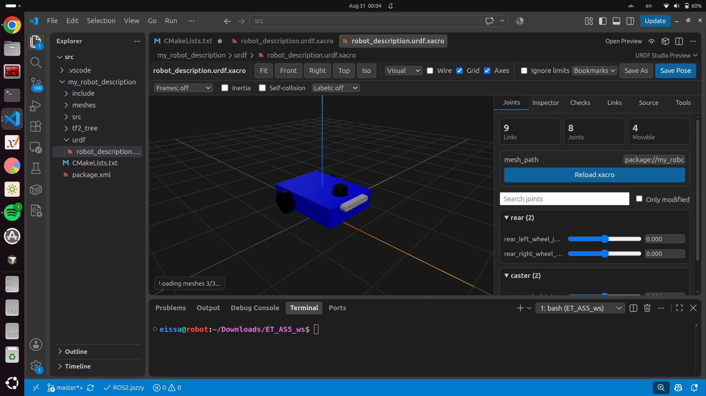
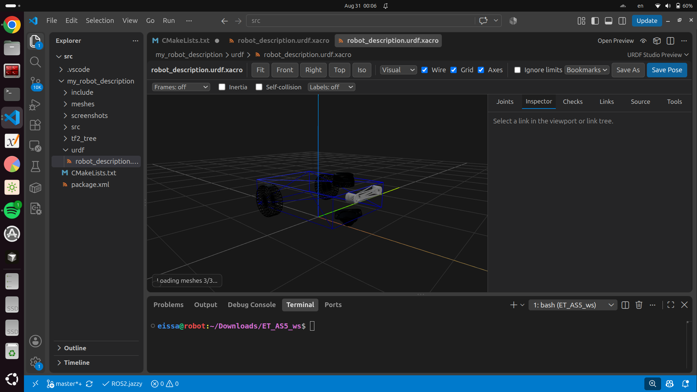

# my_robot_description

A ROS 2 (Jazzy) URDF/Xacro robot description package for "Eissa" — a differential-drive mobile robot with a caster wheel, LiDAR, and a ZED camera, built with reusable Xacro properties and macros.

## Screenshots

| Isometric View | Full Robot Preview |
| :---: | :---: |
|  |  |

---

## Robot Structure

* **`base_footprint`**: Root reference frame (no geometry, standard ROS convention).
* **`chassis`**: Main body (box), connected to `base_footprint` via a fixed joint.
* **`rear_left_wheel` / `rear_right_wheel`**: Driven wheels, connected via continuous joints (built from a single reusable `wheel_xacro` macro).
* **`caster_swivel_link` + `caster_wheel_link`**: Free caster wheel, modeled with two continuous joints (a vertical swivel + a wheel roll) for realistic two-degree-of-freedom motion.
* **`lidar_link`**: LiDAR sensor (mesh), fixed to the chassis.
* **`camera_link` + `camera_optical_link`**: ZED camera (mesh) and its optical frame, fixed to the chassis.

All dimensions, offsets, and mount positions are defined once as `<xacro:property>` values at the top of the file, so resizing any part of the robot only requires editing one number.

---

## Package Layout

```text
my_robot_description/
├── include/
│   └── my_robot_description/
├── meshes/
│   ├── Caster_Wheel.stl
│   ├── lidar.STL
│   └── zed.stl
├── screenshots/
│   ├── Full_robot_preview.png
│   └── iso.png
├── src/
├── tf2_tree/
│   ├── frames_2026-08-31_19.41.05.pdf
│   └── frames_2026-08-31_19.41.05.gv
├── urdf/
│   └── robot_description.urdf.xacro
├── CMakeLists.txt
├── package.xml
└── README.md
```

---

## Prerequisites

* **ROS 2 Packages**:
  ```bash
  sudo apt install ros-jazzy-xacro \
                    ros-jazzy-robot-state-publisher \
                    ros-jazzy-joint-state-publisher-gui
  ```
* **VS Code Extension**: Install the **URDF Previewer** extension (or **URDF** by *smoradd*) in VS Code.

---

## Build

From the root of your workspace:

```bash
colcon build --packages-select my_robot_description
source install/setup.bash
```

---

## Preview the Robot (VS Code URDF Previewer)

1. Open your workspace directory in **VS Code**.
2. Open `urdf/robot_description.urdf.xacro`.
3. Click the **URDF Preview** button in the top-right corner of the editor window (or press `Ctrl+Shift+P` and run **URDF: Preview URDF**).
4. The 3D model will render directly inside VS Code, displaying the chassis, wheels, caster, LiDAR, and camera meshes.

---

## Validating the Xacro/URDF Manually

To process the Xacro into a plain URDF and verify its structure:

```bash
ros2 run xacro xacro urdf/robot_description.urdf.xacro > /tmp/robot.urdf
check_urdf /tmp/robot.urdf
```

`check_urdf` should print the full link/joint tree with no errors.

---

## Notes

* The caster wheel is modeled with two real joints (swivel + roll) instead of a single fixed joint, allowing realistic motion.
* Mesh files are referenced with `package://my_robot_description/meshes/...` URIs. Make sure your package paths are correctly resolved in your workspace environment for meshes to render.
