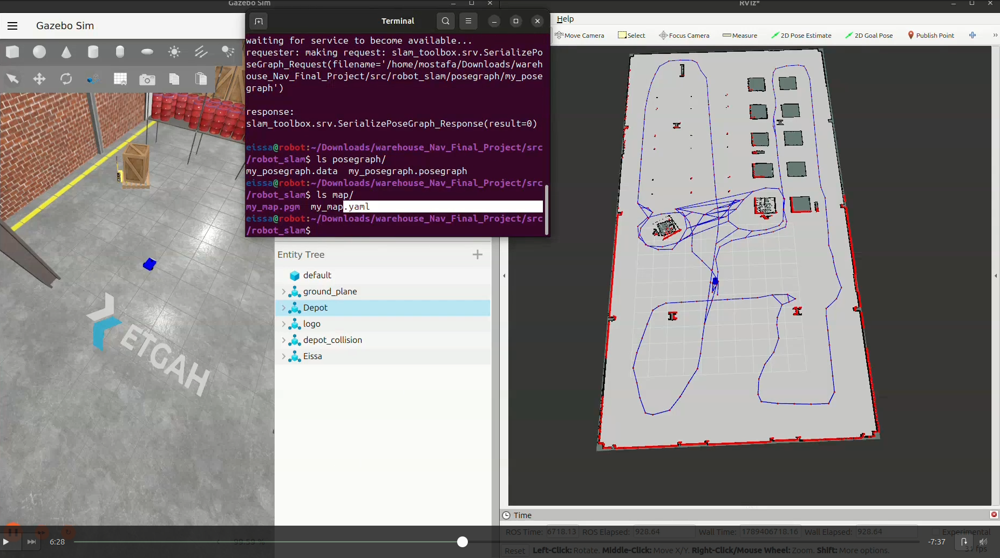
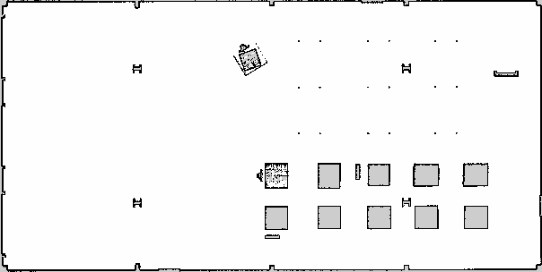
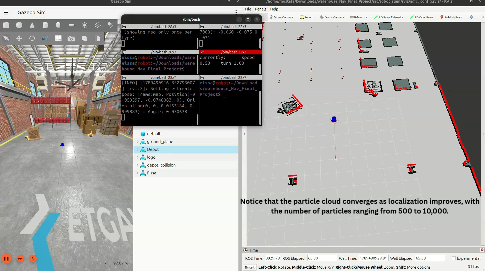
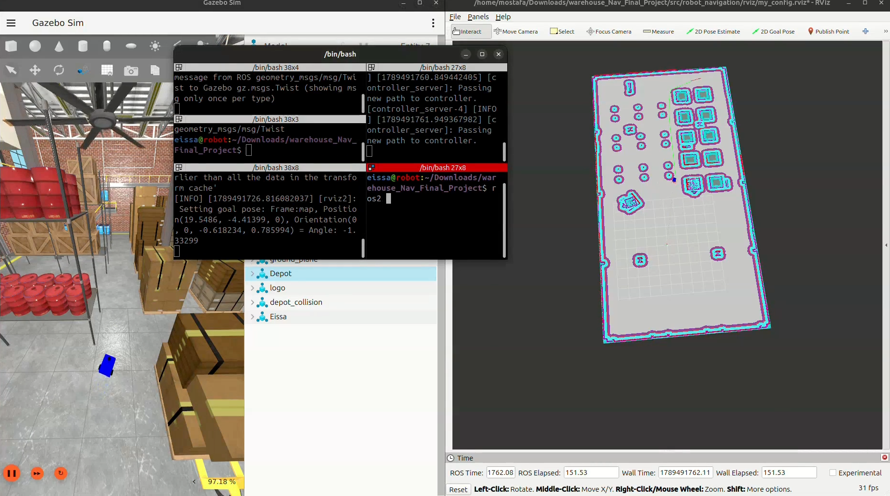
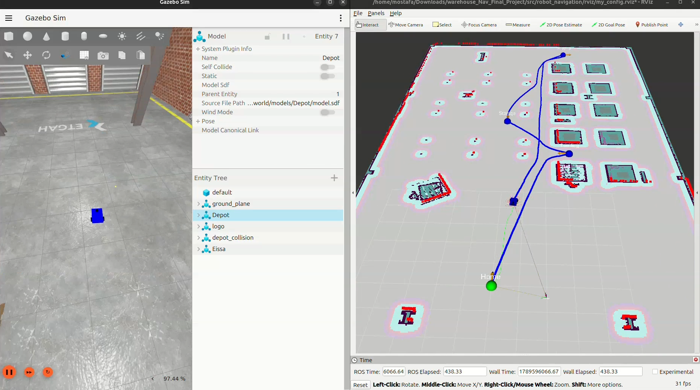

# Autonomous Warehouse Waypoint Delivery Robot

**Repository:** https://github.com/mustafakhaleed/warehouse-waypoint-nav-mostafa-eissa

## 1. Project Overview and Mission

This project implements an autonomous mobile robot that maps, localizes, and
navigates through a series of named waypoints inside a simulated warehouse
environment, using ROS 2 (Jazzy) and the Nav2 navigation stack.

**Mission summary:**
- Start at the **Charging Station (Home)**.
- Navigate to the **Loading Station** and wait **30 seconds**.
- Navigate to the **Storage Area**.
- Navigate to the **Shipping Station**.
- Return to the **Charging Station (Home)**.
- Wait for each Nav2 navigation result before sending the next goal.
- If any goal fails, stop the mission and report the failed location.

All waypoints are displayed live in RViz as named markers. The currently
active navigation goal is shown in **green**; all other waypoints remain
**blue**.

> **Note on robot platform:** This submission uses a custom-built
> differential-drive robot ("Eissa") in place of the TurtleBot3 Burger
> specified in the base assignment. This substitution was reviewed and
> approved by the team leader prior to submission.

---

## 2. Repository and Package Structure

This workspace is organized into four ROS 2 packages under `src/`:

```
warehouse_Nav_Final_Project/
└── src/
    ├── robot_description/            # Custom robot model (URDF/xacro, meshes, Gazebo spawn launch)
    │   ├── urdf/
    │   │   ├── robot.urdf.xacro
    │   │   ├── robot.gazebo.xacro
    │   │   └── robot.urdf
    │   ├── meshes/
    │   │   ├── lidar.STL
    │   │   ├── zed.stl
    │   │   └── Caster_Wheel.stl
    │   ├── config/
    │   │   └── gz_bridge.yaml
    │   ├── launch/
    │   │   └── gazebo.launch.py
    │   ├── include/
    │   ├── src/
    │   ├── CMakeLists.txt
    │   └── package.xml
    │
    ├── robot_slam/                    # SLAM Toolbox mapping
    │   ├── config/
    │   │   └── mapper_params_online_async.yaml
    │   ├── launch/
    │   │   └── online_async_launch.py
    │   ├── map/
    │   │   ├── my_map.yaml
    │   │   ├── my_map.pgm
    │   │   └── my_map.png
    │   ├── posegraph/
    │   │   ├── my_posegraph.data
    │   │   └── my_posegraph.posegraph
    │   ├── rviz/
    │   │   └── amcl_config.rviz
    │   ├── include/
    │   ├── src/
    │   ├── CMakeLists.txt
    │   └── package.xml
    │
    ├── robot_navigation/               # Nav2 configuration and bring-up
    │   ├── config/
    │   │   ├── amcl.yaml
    │   │   ├── planner_server.yaml     # includes global_costmap parameters
    │   │   ├── controller_server.yaml  # includes local_costmap parameters
    │   │   ├── behavior_server.yaml
    │   │   └── bt_navigator.yaml
    │   ├── launch/
    │   │   └── nav2_bringup.launch.py
    │   ├── maps/
    │   │   ├── my_map.yaml
    │   │   └── my_map.pgm
    │   ├── posegraph/
    │   │   ├── my_posegraph.data
    │   │   └── my_posegraph.posegraph
    │   ├── frames/                     # tf2_tools view_frames output
    │   │   ├── frames_2026-09-15_19.50.30.gv
    │   │   └── frames_2026-09-15_19.50.30.pdf
    │   ├── rviz/
    │   │   └── navigation.rviz
    │   ├── include/
    │   ├── src/
    │   ├── CMakeLists.txt
    │   └── package.xml
    │
    └── warehouse_waypoints/            # Waypoint mission node + marker publisher
        ├── resource/
        │   └── warehouse_waypoints
        ├── warehouse_waypoints/
        │   ├── __init__.py
        │   ├── waypoint_mission.py      # sends the ordered Nav2 goals
        │   └── waypoint_markers.py      # publishes the RViz MarkerArray
        ├── test/
        ├── package.xml
        ├── setup.cfg
        └── setup.py
```

> **Note on structure:** The assignment template lists only two packages
> (`robot_navigation` and `warehouse_waypoints`). This repository also
> includes `robot_description` and `robot_slam`, the packages actually used
> to build the robot model, spawn it in the warehouse world, and produce the
> map that `robot_navigation` and `warehouse_waypoints` depend on.

**Package roles:**
- `robot_description` — defines the robot's physical model (differential
  drive base, LiDAR, camera, caster wheel) and spawns it into the warehouse
  Gazebo world.
- `robot_slam` — runs SLAM Toolbox (`online_async_launch.py`) and stores the
  resulting map (`my_map.yaml`/`.pgm`/`.png`) and serialized pose graph.
- `robot_navigation` — holds all Nav2 parameter files (AMCL, planner,
  controller, behavior server, BT navigator), the map used for localization,
  and the RViz configuration used for navigation.
- `warehouse_waypoints` — a Python (ament_python) package containing
  `waypoint_mission.py` (sends the ordered sequence of Nav2 goals) and
  `waypoint_markers.py` (publishes the waypoint `MarkerArray` to RViz).

The `warehouse_world` package (provided by ETGAH) is built in its own
**separate workspace** and is **not** included in this repository — see the
build instructions below for how both workspaces are set up and sourced
together.

---

## 3. Workspace Build Instructions

`warehouse_world` (provided by ETGAH) is built as its **own separate
workspace**, not inside `warehouse_Nav_Final_Project`. This project's
packages are built in their own workspace as well. Both workspaces must be
sourced — in the order below — before launching anything.

```bash
# 1. Build the provided warehouse world in its own workspace
mkdir -p ~/warehouse_world_ws/src
cd ~/warehouse_world_ws/src
git clone https://github.com/ETGAH/warehouse_world.git
cd ~/warehouse_world_ws
colcon build

# 2. Build this project's packages in a separate workspace
mkdir -p ~/warehouse_Nav_Final_Project/src
cd ~/warehouse_Nav_Final_Project/src
git clone https://github.com/mustafakhaleed/warehouse-waypoint-nav-mostafa-eissa.git
cd ~/warehouse_Nav_Final_Project
colcon build
```

> **Important — every new terminal:** source both workspaces, in this
> exact order, before running any command below. `warehouse_world` must be
> sourced first so its resource paths (world file, models) are set up
> before this project's launch files try to use them:
>
> ```bash
> source ~/warehouse_world_ws/install/setup.bash
> source ~/warehouse_Nav_Final_Project/install/setup.bash
> ```

---

## 4. Launching the Robot Inside the Warehouse World

```bash
ros2 launch robot_description gazebo.launch.py
```

This launch file:
- Starts the warehouse world (`warehouse_storage.sdf`) via
  `warehouse_world`'s own launch file.
- Publishes the robot's URDF (`robot_state_publisher`).
- Spawns the robot into the running world at a fixed starting pose.
- Starts the `ros_gz_bridge` topics for `/cmd_vel`, `/odom`, `/tf`,
  `/joint_states`, `/scan`, `/camera/image_raw`, and `/camera/camera_info`.
- Opens the Gazebo GUI.

---

## 5. Mapping the Warehouse Using SLAM Toolbox

```bash
ros2 launch robot_slam online_async_launch.py
```

This launches SLAM Toolbox with the parameters defined in
`robot_slam/config/mapper_params_online_async.yaml`. Teleoperate the robot
through every aisle of the warehouse, covering all walls, corners, and open
areas, until the map is fully explored with no large unmapped gaps or
duplicated walls, while watching the live map build in RViz.

---

## 6. Saving the Warehouse Map

```bash
ros2 run nav2_map_server map_saver_cli -f ~/warehouse_Nav_Final_Project/src/robot_slam/map/my_map
```

The resulting map (`my_map.yaml`, `my_map.pgm`, `my_map.png`) and the
serialized pose graph (`my_posegraph.data`, `my_posegraph.posegraph`) are
stored in `robot_slam/map/` and `robot_slam/posegraph/`. A copy of the map
(`my_map.yaml`, `my_map.pgm`) used for localization is kept in
`robot_navigation/maps/`.

---

## 7. Launching and Testing AMCL Localization

AMCL was launched as part of the full Nav2 bring-up (Section 8), rather than
as a separate standalone launch file. It was validated in isolation before
running the full mission by:

- Adding **only** the `Map` display in RViz (leaving out costmaps and other
  Nav2 topics) so the raw localization behavior could be checked without
  navigation clutter.
- Setting the Fixed Frame in RViz to `map`.
- Setting the robot's initial pose using **2D Pose Estimate**.
- Driving the robot manually with keyboard teleop from a terminal
  (`teleop_twist_keyboard`) and confirming the particle cloud converges and
  the LiDAR scan aligns with the mapped walls as the robot moves.
- Confirming `map -> odom -> base_footprint` remains available via
  `tf2_ros`, and that `/amcl_pose` updates continuously while driving.

---

## 8. Launching the Complete Nav2 System

```bash
ros2 launch robot_navigation nav2_bringup.launch.py
```

All lifecycle nodes (`map_server`, `amcl`, `controller_server`,
`planner_server`, `behavior_server`, `bt_navigator`) were confirmed to reach
the `active` state via:

```bash
ros2 lifecycle get /map_server
ros2 lifecycle get /amcl
ros2 lifecycle get /controller_server
ros2 lifecycle get /planner_server
ros2 lifecycle get /behavior_server
ros2 lifecycle get /bt_navigator
```

A manual **2D Goal Pose** was tested in RViz before running the automated
mission, confirming the robot plans a path on both the global and local
costmap and reaches the goal while avoiding obstacles. `/cmd_vel` uses plain
`geometry_msgs/msg/Twist` (not `TwistStamped`) throughout the stack.

---

## 9. Waypoint Names, Positions, and Orientations

All poses are given in the `map` frame (x, y in meters, yaw in radians).

| Waypoint | Name              | x     | y      | yaw   |
|----------|-------------------|-------|--------|-------|
| HOME     | Charging Station  | 0.00  | 0.00   | 0.00  |
| 01       | Loading Station   | 7.88  | -3.22  | 1.57  |
| 02       | Storage Area      | 10.78 | 0.08   | 0.00  |
| 03       | Shipping Station  | 19.66 | -3.42  | -1.57 |

---

## 10. Mission Route

```
Charging Station (Home)
   -> Loading Station           (wait 30 seconds)
   -> Storage Area
   -> Shipping Station
   -> Charging Station (Home)   [mission complete]
```

The mission node waits for each Nav2 `NavigateToPose` action result before
sending the next goal. If any goal is aborted, canceled, or rejected, the
mission stops immediately and the failed waypoint name is printed to the
terminal.

---

## 11. RViz Waypoint Marker Behavior

All four waypoints are published as a single `visualization_msgs/msg/MarkerArray`
on the `/waypoint_markers` topic, with a `Marker.TEXT_VIEW_FACING` label
showing the station name above each point.

- **Blue** — inactive waypoint.
- **Green** — the currently active navigation goal.

Every time the mission node advances to a new goal, it republishes the full
`MarkerArray` with updated colors so exactly one marker is green at any time.

---

## 12. Required Terminal Output

```
[INFO] [basic_navigator]: Nav2 is ready for use!
[INFO] [waypoint_marker_publisher]: Active goal changed to: Home
[INFO] [waypoint_marker_publisher]: Navigating to Loading...
[INFO] [waypoint_marker_publisher]: Active goal changed to: Loading
[INFO] [basic_navigator]: Navigating to goal: 7.88 -3.22...
[INFO] [waypoint_marker_publisher]: Reached Loading
[INFO] [waypoint_marker_publisher]: Waiting 30 seconds at Loading Station...
[INFO] [waypoint_marker_publisher]: 30-second wait completed. Continuing mission...
[INFO] [waypoint_marker_publisher]: Navigating to Storage...
[INFO] [waypoint_marker_publisher]: Active goal changed to: Storage
[INFO] [waypoint_marker_publisher]: Reached Storage
[INFO] [waypoint_marker_publisher]: Navigating to Shipping...
[INFO] [waypoint_marker_publisher]: Active goal changed to: Shipping
[INFO] [waypoint_marker_publisher]: Reached Shipping
[INFO] [waypoint_marker_publisher]: Navigating to Home...
[INFO] [waypoint_marker_publisher]: Active goal changed to: Home
[INFO] [waypoint_marker_publisher]: Reached Home
[INFO] [waypoint_marker_publisher]: Mission complete. Returned to Home.
```
---

## 13. Problems Encountered and Their Solutions

| # | Problem | Root Cause | Solution |
|---|---------|------------|----------|
| 1 | Gazebo GUI failed to load the robot's meshes (`Unable to find file ... model://robot_description/meshes/...`) | `warehouse_storage_launch.launch.py` (from the `warehouse_world` package) sets its own `GZ_SIM_RESOURCE_PATH`, overwriting rather than appending to the one set in our own launch file. | Merged both packages' resource paths into a single `GZ_SIM_RESOURCE_PATH` value inside our own launch file, and ordered the actions so ours is applied after the warehouse world's include. |
| 2 | Gazebo server crashed on startup with `Err] [BaseStorage.hh:975] Another item already exists with name: scene` followed by `Ogre::ItemIdentityException: A material datablock ... already exists` (exit code 134 / SIGABRT) | The `gz::sim::systems::Sensors` plugin was declared twice — once at the world level (inside `warehouse_storage.sdf` from the `warehouse_world` package) and again inside `robot.gazebo.xacro` for the robot model. This plugin is meant to be loaded once per world, not once per model, so loading it twice caused a duplicate render-scene/material name collision in the Ogre2 renderer during `RenderUtil::Init()`. | Removed the duplicate `<plugin filename="gz-sim-sensors-system" name="gz::sim::systems::Sensors">...</plugin>` block from `robot.gazebo.xacro`, keeping only the single instance already loaded at the world level. The robot's `rgb_camera` and `lidar_sensor` continue to work correctly since they only need the Sensors system running once in the shared world. |
| 3 | RViz's `Map` display showed "No map received" even though `ros2 topic echo /map` and the costmaps worked fine | RViz's subscription to `/map` was using `VOLATILE` durability instead of `TRANSIENT_LOCAL`, so it never received the map published once by `map_server` before the subscription existed. | Manually set the `Map` display's **Topic → Durability Policy** to `Transient Local` in RViz, matching the publisher's QoS. |
| 4 | The Nav2 Lifecycle Manager never activated any of the Nav2 nodes (they stayed stuck in `unconfigured`/`inactive`) | In `amcl.yaml`, `laser_max_range` was written as an integer (`20`) instead of a float (`20.0`). Since this parameter is declared as a `double` in AMCL, the type mismatch caused parameter loading to fail, so the node could never finish configuring, and the Lifecycle Manager's activation step for the whole stack was blocked. | Changed the value to `laser_max_range: 20.0` (explicit float) in `amcl.yaml`. |
| 5 | Two separate `ros_gz_bridge` (gz-bridge) processes were running at the same time, causing redundant/conflicting bridged topics | `robot_description`'s `gazebo.launch.py` includes `warehouse_world`'s `warehouse_storage_launch.launch.py`, which starts **its own** `ros_gz_bridge` node (for the world/clock), in addition to the bridge node started by our own launch file for the robot's topics (`/cmd_vel`, `/odom`, `/scan`, etc.). | Disabled/removed the `ros_gz_bridge` node inside `warehouse_storage_launch.launch.py`, keeping only the single bridge started by `robot_description`'s launch file. |

---

## 14. Screenshots

All images referenced below are stored in `Images_Video/`.

**SLAM Toolbox mapping in progress**


**Final saved warehouse map**


**AMCL localization (particle cloud converged, scan aligned with map)**


**Nav2 global/local costmaps with a planned path**


**Active goal marker shown in green during the mission**


---

## 15. Demonstration Video

A complete narrated video demonstrating the project from start to finish
(SLAM mapping, AMCL localization ,Nav2 goal
testing, the full autonomous mission, and the RViz waypoint markers
updating throughout) is available here:

https://drive.google.com/drive/folders/1Qra18BZYhyeVpj-MjPMVwO96DapfvSLD?usp=drive_link

